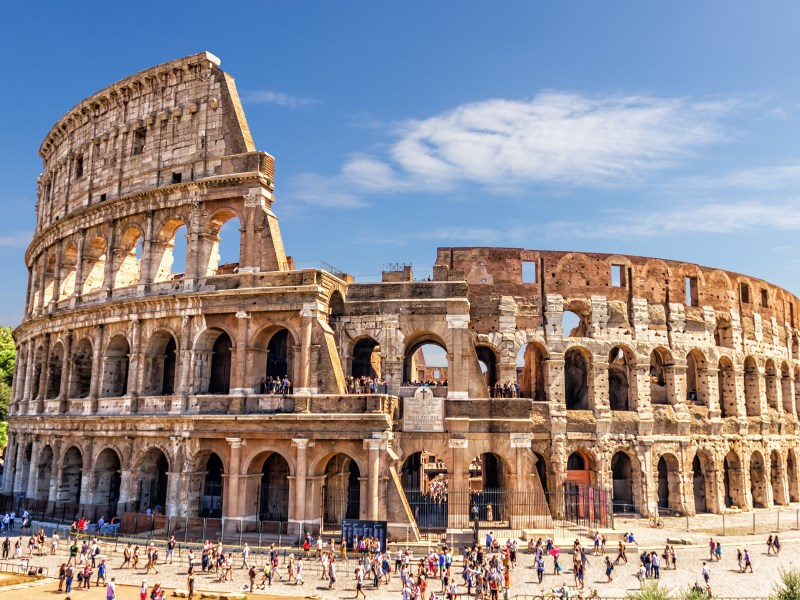

# Google-Landmark-Retrrieval
Google Landmark Retrieval competition at Kaggle

https://www.kaggle.com/c/landmark-retrieval-2020

Image retrieval is a fundamental problem in computer vision: given a query image, can you find similar images in a large database? This is especially important for query images containing landmarks, which accounts for a large portion of what people like to photograph.

In this competition, the developed models are expected to retrieve relevant database images to a given query image (ie, the model should retrieve database images containing the same landmark as the query). This challenge is organized in conjunction with the Landmark Recognition Challenge 2020. Both challenges will be discussed at the Instance-Level Recognition workshop in ECCV'20.
